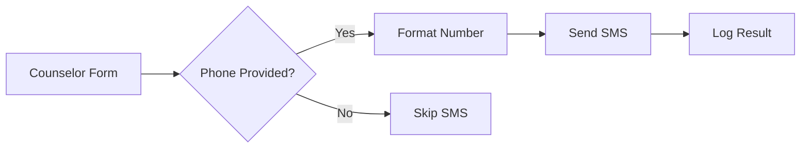

# SMS Integration Documentation
## ActiveTrail SMS Service for Gesher Intake System

---

## 📱 Overview

The Gesher Intake System now includes SMS notifications via ActiveTrail, an Israeli SMS service provider. This enables dual-channel communication with parents, ensuring they receive consent form links through both email and SMS.

## 🚀 Current Status

- **Status**: ✅ Fully Operational in Production
- **Provider**: ActiveTrail (webapi.mymarketing.co.il)
- **Deployment**: Live on Vercel with environment variables configured
- **Last Updated**: January 2025

## 🔧 Technical Implementation

### Service Architecture

```
src/lib/sms.ts
├── ActiveTrailSMS class
├── Phone number formatting (Israeli)
├── SMS templates (Hebrew)
├── Error handling & fallbacks
└── Export functions (sendConsentSMS, sendCounselorSMS)
```

### Key Features

1. **Automatic Phone Formatting**
   - Handles Israeli numbers (05x-xxxxxxx)
   - Converts to international format (+972)
   - Removes non-digit characters

2. **Dual Notification System**
   - Email sent when email provided
   - SMS sent when phone provided
   - Both sent when both provided
   - Fallback: If one fails, other continues

3. **Hebrew SMS Templates**
   - Parent consent request
   - Counselor notification
   - All messages in Hebrew with RTL support

## 📝 Configuration

### Environment Variables

Add to `.env.local` for local development:

```env
# ActiveTrail SMS Configuration
ACTIVETRAIL_API_KEY=your_api_key_here
ACTIVETRAIL_BASE_URL=https://webapi.mymarketing.co.il
ACTIVETRAIL_SENDER_ID=GesherYouth
```

### Vercel Production Variables

Already configured in Vercel dashboard:
- ✅ `ACTIVETRAIL_API_KEY` (encrypted)
- ✅ `ACTIVETRAIL_BASE_URL`
- ✅ `ACTIVETRAIL_SENDER_ID`

## 🧪 Testing

### Local Testing

```bash
# Test SMS sending
node test-sms.js 0501234567

# Test with different number
node test-sms.js 0521234567
```

### Production Testing

1. Go to https://gesher-intake.vercel.app
2. Submit form with phone number
3. Check SMS delivery

## 📊 API Integration

### Endpoints Used

1. **Primary**: `/api/external/operational/sms_message`
2. **Fallback**: `/api/smscampaign/OperationalMessage`

### Request Format

```javascript
{
  phone_number: "+972501234567",
  message: "Hebrew message text",
  sender_id: "GesherYouth"
}
```

### Response Handling

```javascript
{
  success: true,
  messageId: "message_id_from_api"
}
```

## 🔄 Workflow Integration

### When Parent Phone Provided



### Notification Priority

1. **Both email + phone**: Send both notifications
2. **Email only**: Send email notification
3. **Phone only**: Send SMS notification
4. **Neither**: Log warning, continue process

## 📋 SMS Message Templates

### Parent Consent Request
```hebrew
גשר אל הנוער: נדרשת חתימתך על טופס ויתור סודיות עבור הרשמת ילדך לתוכנית. 
לחץ על הקישור: [consent_url]
```

### Counselor Notification
```hebrew
גשר אל הנוער: ההורים חתמו על ויתור סודיות עבור [student_name]. 
השלם את הרישום: [form_url]
```

## 🛠️ Troubleshooting

### Common Issues

1. **SMS Not Sending**
   - Check API key is valid
   - Verify phone format (+972...)
   - Check ActiveTrail credits
   - Review logs in Vercel Functions

2. **Invalid Phone Number**
   - Ensure Israeli format (05x-xxxxxxx)
   - Check no extra characters
   - Verify 10 digits total

3. **API Errors**
   - Check environment variables
   - Verify API endpoint availability
   - Review error logs

### Debug Commands

```bash
# Check environment variables
vercel env ls production | grep ACTIVETRAIL

# View function logs
vercel logs --yes

# Test connection
node test-sms.js
```

## 📈 Monitoring

### Success Metrics
- SMS delivery rate
- Response time
- Fallback usage
- Error frequency

### Log Messages
- `Consent SMS sent to parent: [phone]`
- `Failed to send SMS: [error]`
- `SMS fallback attempted`

## 🔐 Security Considerations

1. **API Key Protection**
   - Stored in environment variables
   - Never committed to code
   - Encrypted in Vercel

2. **Phone Number Privacy**
   - Numbers not logged in full
   - Temporary storage only (72 hours)
   - No persistent SMS logs

3. **Rate Limiting**
   - API rate limits apply
   - Middleware protection
   - Fallback on failures

## 📞 Support

### ActiveTrail Support
- Documentation: https://webapi.mymarketing.co.il/api/docs
- Contact: Via ActiveTrail dashboard

### System Issues
- Check Vercel logs
- Review this documentation
- Test with `test-sms.js`

## ✅ Checklist for New Deployments

- [ ] Get ActiveTrail API key
- [ ] Add environment variables to Vercel
- [ ] Test SMS locally with `test-sms.js`
- [ ] Deploy to production
- [ ] Verify SMS delivery in production
- [ ] Monitor logs for first 24 hours

---

*This documentation is part of the Gesher Intake System*
*Last Updated: January 2025*